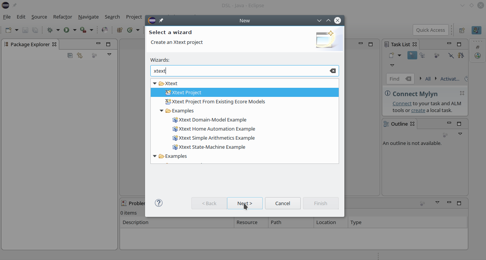
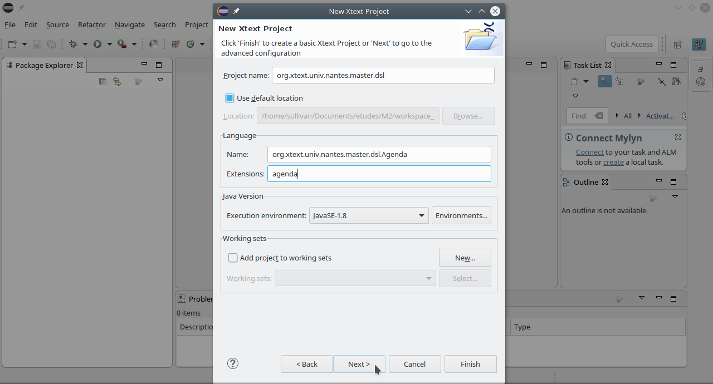
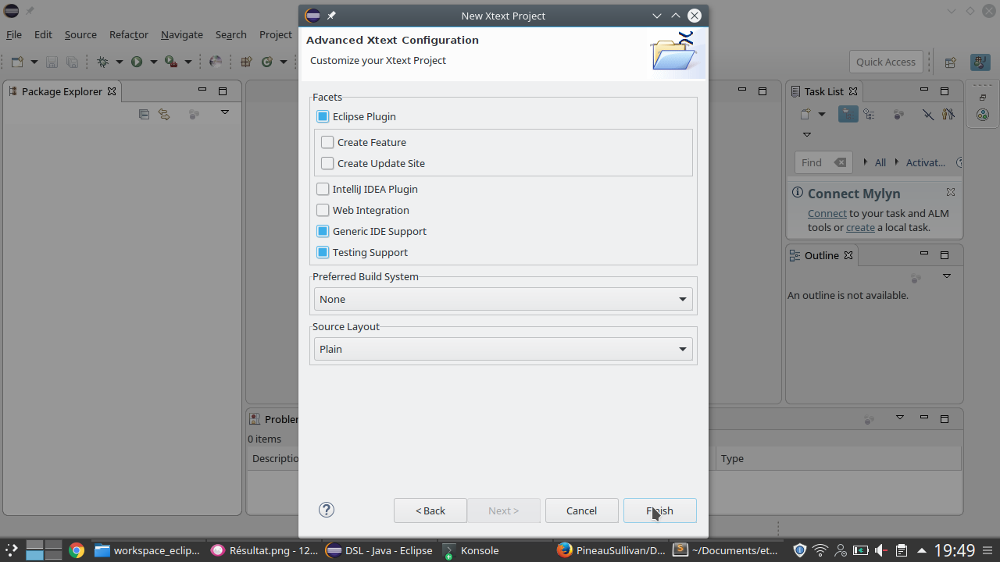
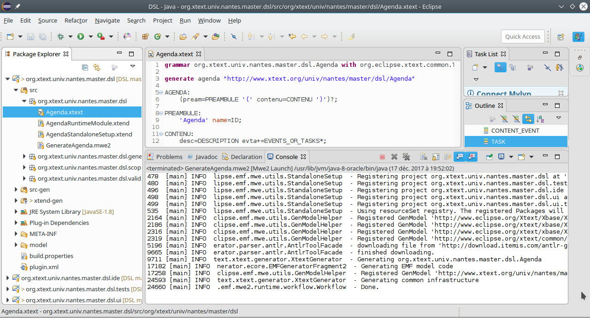
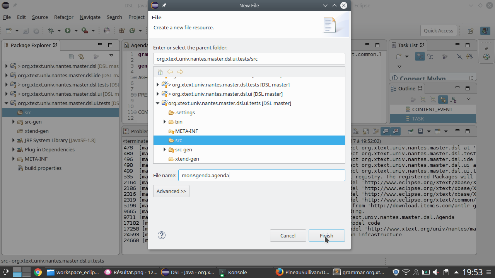
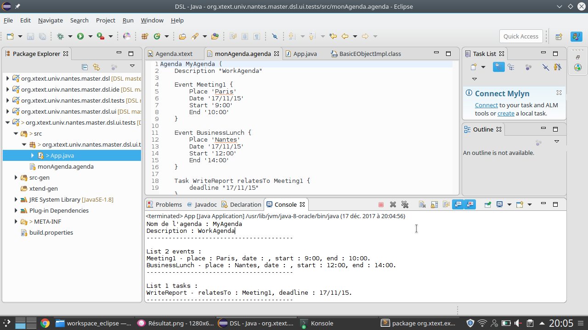

Domain Specific Languages
=========================

[Lien du répertoire github](https://github.com/PineauSullivan/DSL)
Ce projet a été réalisé par [Sullivan Pineau](https://github.com/PineauSullivan/).
Les consignes de ce projet se trouvent [ici](https://gitlab.univ-nantes.fr/sunye-g/dsl) !

Étape 1
-------
Tout d'abord, il faut créer un projet Xtext, voici la procédure à suivre :




Étape 2
-------
Ensuite, il faut modifier la grammaire puis faire clique droit sur celui-ci -> "Run As" -> "Generate Xtext Artifacts".
Voici le résultat obtenu :


Étape 3
-------
Puis, il faut ajouter un Agenda sous le bon format (dans mon cas, ".agenda"). 


Étape 4
-------
Enfin, il suffit de faire un main permettent de lire son agenda.
Voici comment il faut faire pour lire les ressources de votre agenda :
```java
// do this only once per application
Injector injector = new AgendaStandaloneSetup().createInjectorAndDoEMFRegistration();

// obtain a resourceset from the injector
XtextResourceSet resourceSet = injector.getInstance(XtextResourceSet.class);
		 
// load a resource by URI, in this case from the file system
Resource resource = resourceSet.getResource(URI.createFileURI("./src/monAgenda.agenda"), true);
		
TreeIterator<EObject> it = resource.getAllContents();
while(it.hasNext()) {
			EObject object = it.next();
			[...]
}
```

Étape 5
-------
Pour finir, voici le résultat de l'exécution du main :
 

