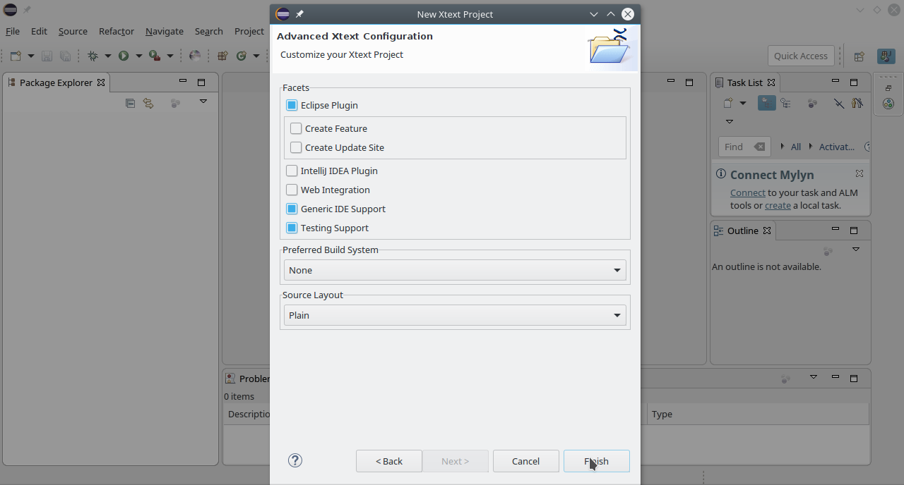

Domain Specific Languages
=========================

[Lien du répertoire github](https://github.com/PineauSullivan/DSL)

Ce projet a été réalisé par [Sullivan Pineau](https://github.com/PineauSullivan/).

Les consignes de ce projet se trouvent [ici](https://gitlab.univ-nantes.fr/sunye-g/dsl) !

Étape 1
-------
Tout d'abord, il faut créer un projet Xtext, voici la procédure à suivre :




Étape 2
-------
Ensuite, il faut modifier la grammaire puis faire clique droit sur celui-ci -> "Run As" -> "Generate Xtext Artifacts".

Voici le résultat obtenu :


Étape 3
-------
Puis, il faut ajouter un agenda sous le bon format (dans mon cas, ".agenda").
*Remarque : j'ai réalisé une grammaire qui permet de définir autant d'agendas que nous le désirons dans un seul fichier.*

Exemple :
```
Agenda MyAgenda1 (
    Description "WorkAgenda"

    Event Meeting1 {
        Place 'Paris'
        Date '17/11/15'
        Start '9:00'
        End '10:00'
    }

    Event BusinessLunch {
        Place 'Nantes'
        Date '17/11/15'
        Start '12:00'
        End '14:00'
    }

    Task WriteReport relatesTo Meeting1 {
        deadline "17/11/15"
    }
    
)

Agenda MyAgenda2 (
    Description "WorkAgenda2"

    Event Meeting2 {
	        Place 'Paris'
	        Date '17/11/15'
	        Start '9:00'
	        End '10:00'
    }
}
```

Étape 4
-------
Enfin, il suffit de faire un main permettant de lire son agenda.

Voici comment il faut faire pour lire les ressources de votre agenda :
```java
// do this only once per application
Injector injector = new AgendaStandaloneSetup().createInjectorAndDoEMFRegistration();

// obtain a resourceset from the injector
XtextResourceSet resourceSet = injector.getInstance(XtextResourceSet.class);
		 
// load a resource by URI, in this case from the file system
Resource resource = resourceSet.getResource(URI.createFileURI("./src/monAgenda.agenda"), true);
		
TreeIterator<EObject> it = resource.getAllContents();
while(it.hasNext()) {
			EObject object = it.next();
			[...]
}
```

Étape 5
-------
Pour finir, voici le résultat de l'exécution du main :
```
+++++++++++++++++++++++++++++++++++++++++++++
Nom de l'agenda : MyAgenda1
Description : WorkAgenda
----------------------------------------

List 2 events :
Meeting1 - place : Paris, date : 17/11/15, start : 9:00, end : 10:00.
BusinessLunch - place : Nantes, date : 17/11/15, start : 12:00, end : 14:00.
----------------------------------------

List 1 tasks :
WriteReport - relatesTo : Meeting1, deadline : 17/11/15.
----------------------------------------

+++++++++++++++++++++++++++++++++++++++++++++
Nom de l'agenda : MyAgenda2
Description : WorkAgenda2
----------------------------------------

List 1 events :
Meeting2 - place : Paris, date : 17/11/15, start : 9:00, end : 10:00.
----------------------------------------

List 0 tasks :
----------------------------------------

+++++++++++++++++++++++++++++++++++++++++++++
Nom de l'agenda : MyAgenda3
Description : WorkAgenda3
----------------------------------------

List 1 events :
Meeting3 - place : Paris, date : 17/11/15, start : 9:00, end : 10:00.
----------------------------------------

List 1 tasks :
WriteReport3 - relatesTo : Meeting3, deadline : 17/11/15.
----------------------------------------

+++++++++++++++++++++++++++++++++++++++++++++
Nom de l'agenda : MyAgenda4
Description : WorkAgenda4
----------------------------------------

List 1 events :
Meeting4 - place : Nantes, date : 17/11/17, start : 9:00, end : 10:00.
----------------------------------------

List 1 tasks :
WriteReport4 - relatesTo : Pas de référence, deadline : 17/11/15.
----------------------------------------

+++++++++++++++++++++++++++++++++++++++++++++
Nom de l'agenda : MyAgenda5
Description : WorkAgenda5
----------------------------------------

List 1 events :
Meeting5 - place : partout, date : 17/11/15, start : 9:00, end : 10:00.
----------------------------------------

List 0 tasks :
----------------------------------------

+++++++++++++++++++++++++++++++++++++++++++++
Nom de l'agenda : MyAgenda6
Description : WorkAgenda6
----------------------------------------

List 1 events :
Meeting6 - place : Ville, date : 17/11/16, start : 9:00, end : 10:00.
----------------------------------------

List 0 tasks :
----------------------------------------
```
